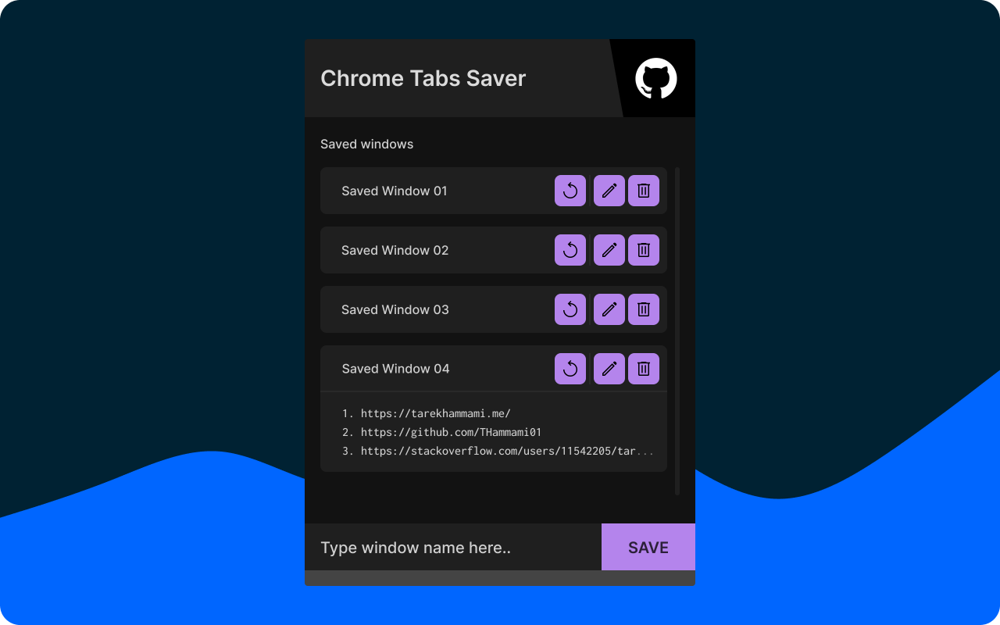

# Chrome Tabs Saver

## About

An extension for Chrome designed to save the currently open tabs in your window, preventing potential loss or the necessity to dig through your browsing history. It allows you to reopen the active window as it is in its current state and at any time.

## UI

[View on Figma](https://www.figma.com/file/CDFdmXkZOThdpadICe1sOU/Chrome-Tabs-Saver?node-id=0%3A1&t=dKX5HDv1oqKUfk7Z-1)

## Installation

### Chrome Web Store

[View on Chrome Web Store](https://chromewebstore.google.com/detail/imcblbcheefgipfifboinjofemckfdmk)

### Manual

1. Download `tabs-saver-ce.zip` from [the latest release](https://github.com/THammami01/tabs-saver-ce/releases/).
2. Unzip it.
3. Go to the extensions tab in Chrome at `chrome://extensions/`.
4. Click on `Load unpacked` and select the unzipped folder.

## Permissions

- `storage` permission is used to save/get the names and URLs of a window's tabs in/from the local storage.
- `tabs` permission is used to retrieve the active window's tabs data, specifically the name and URL of each tab.
