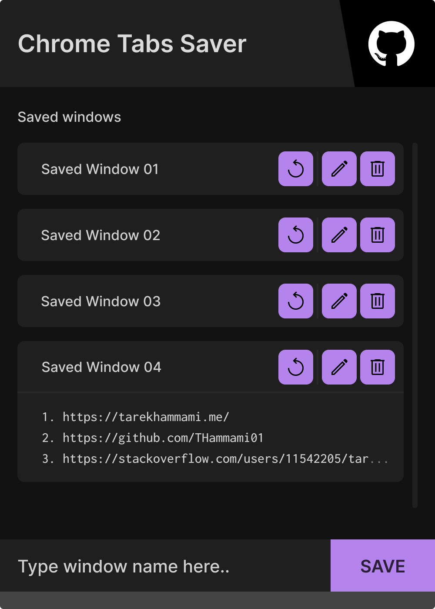

# Chrome Tab Saver

## About

A Chrome extension that saves open tabs so you don't lose them or have to dig through your history if you fail to restore them using the native feature.

## Design

[View on Figma](https://www.figma.com/file/CDFdmXkZOThdpadICe1sOU/Chrome-Tabs-Saver?node-id=0%3A1&t=dKX5HDv1oqKUfk7Z-1)

## Installation

1. Download `tabs-saver-ce.zip` from [the latest release](https://github.com/THammami01/tabs-saver-ce/releases/)
2. Unzip it
3. Go to the extensions tab in Chrome at `chrome://extensions/`
4. Click on `Load unpacked` and select the unzipped folder

## Demo

https://user-images.githubusercontent.com/50141415/212996321-ad97f85e-40c5-4cb4-8305-20af1bab1ed2.mp4

[View on YouTube](https://youtu.be/yC0htL_Agm0)
